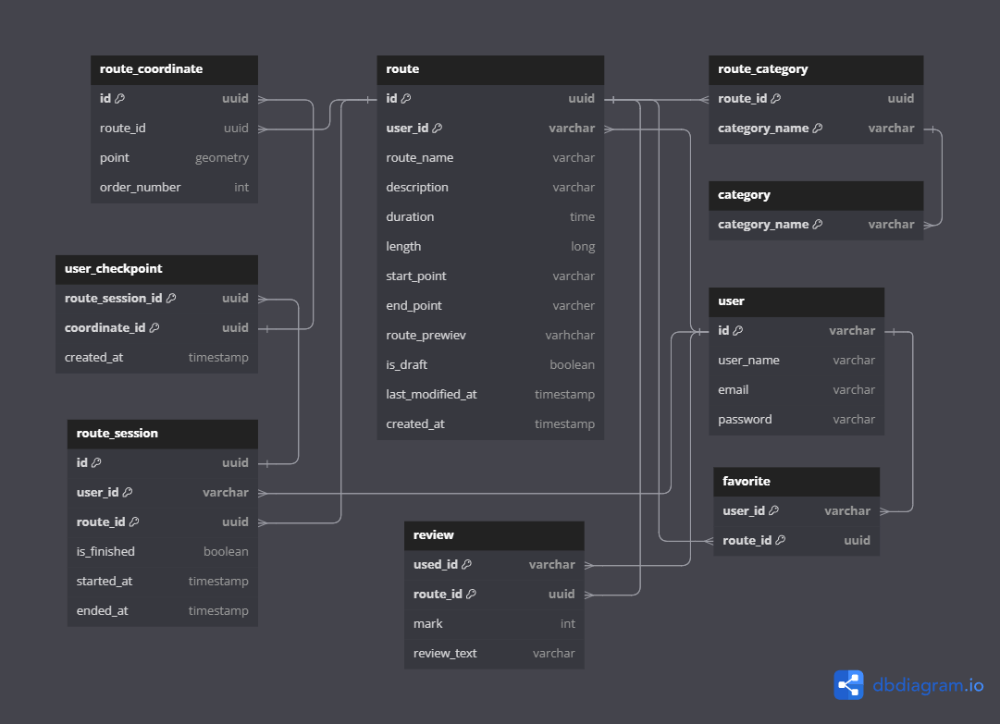
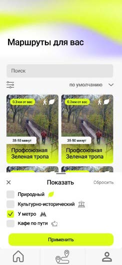
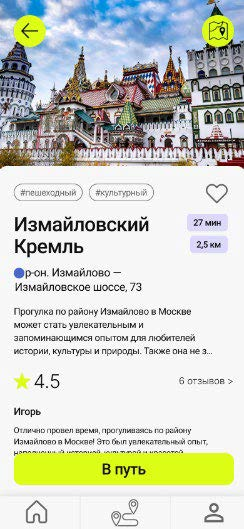
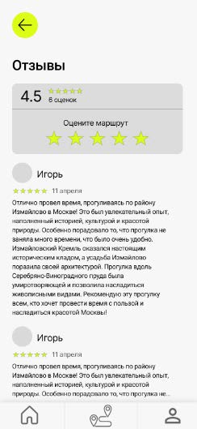
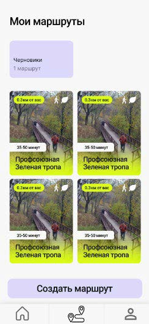
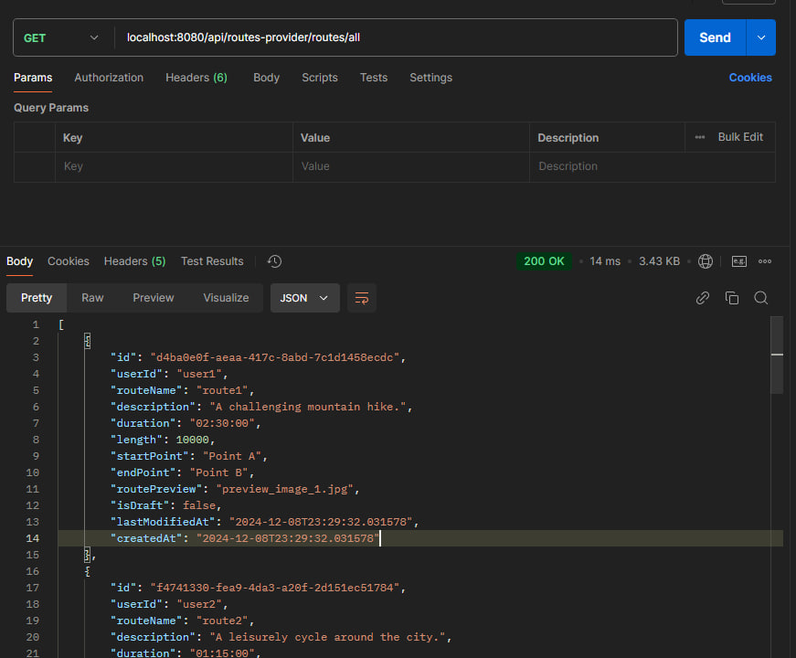
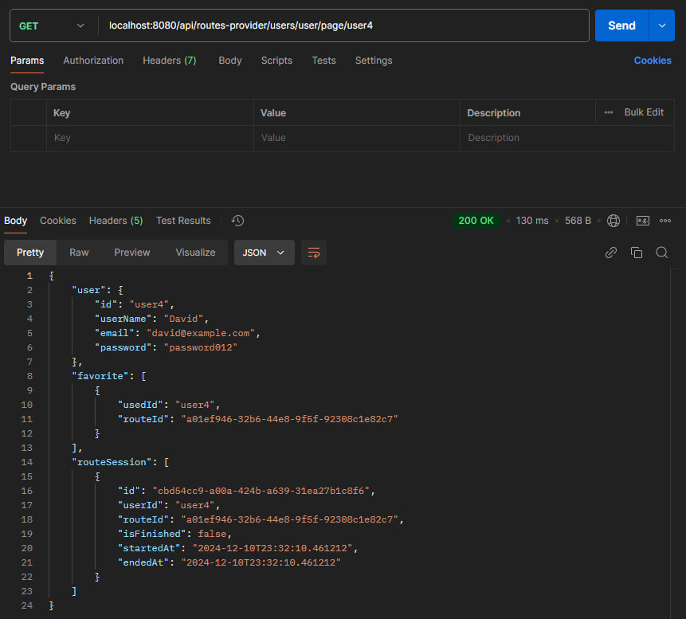
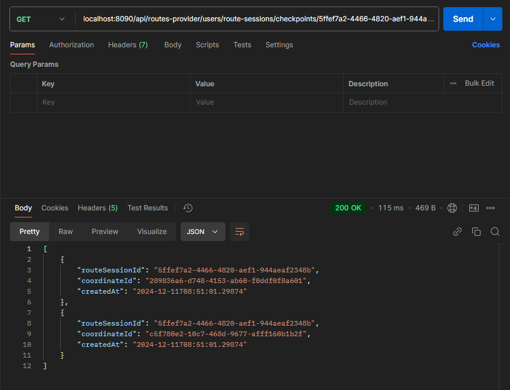

# Приложение для планирования пешеходных маршрутов
## Выполнили студенты группы БПИ224:
* Евсюков Александр
* Егорова Елизавета Петровна
* Кухтина Юлия Егоровна
* Тян Павел

## Аннотация
В рамках курса "Экономика программной инженерии" нам предстояло разделиться на команды 
и придумать проект, по которому в дальнейшем мы выполняли все домашние задания. Мы сочли нашу идею достаточно 
интересной и решили реализовать её бэкенд, который отвечает за работу с базой данных.

Это приложение — прототип сервиса для управления базой данных нашего приложения. В дальнейшем его можно будет расширить добавив больше функциональных возможностей.

## Описание проекта
Приложение для создания и обмена пешеходными маршрутами предоставит
пользователям возможности для планирования прогулок и исследования новых мест.

Основная функция приложения — создание персонализированных маршрутов, где
пользователи могут добавлять важные точки и сохранять маршрут в черновик для
последующего редактирования. Кроме того, в приложении будет реализован поиск
маршрутов с использованием фильтров и сортировки, что позволит находить маршруты,
соответствующие предпочтениям пользователя. При прохождении маршрутов будет
предусмотрена возможность ставить их на паузу и возвращаться к прогулке позже.
Дополнительно будет реализована функция сохранения маршрутов в избранное, чтобы
пользователи могли быстро вернуться к понравившимся вариантам.

## Используемые инструменты
* Язык программирования: Kotlin c Java версией 22
* Система сборки: Gradle 8.2
* Фреймворк: Spring Boot 3.4.0
  * Spring Web - для создания RESTful веб-сервисов
  * Spring Data JDBC - для работы с базой данных
  * Liquibase - для миграции базы данных
* СУБД: PostgreSQL с расширением PostGIS для работы с геоданными (использовали готовый образ)

## Инструкция по запуску
1. Склонируйте репозиторий с помощью команды `git clone`
2. Откройте проект в `IntelliJ IDEA`
3. Запустите БД с помощью команды `docker-compose up -d` в папке `dev-env`
4. Запустите проект с помощью комбинации клавиш `Ctrl + F10` или нажав на кнопку `Run` в правом верхнем углу
5. Перейдите на сайт `http://localhost:8080/` и пользуйтесь (Рекомендую Postman)

P.S. В папке `dev-env` находится файл `dummy_data.sql`, который заполняет базу данных тестовыми данными.

## Пояснительная записка
* Основными конечными пользователями продукта являются люди, которые интересуются прогулками 
  и исследованием новых мест. Приложение предоставляет инструменты для планирования маршрутов, 
  сохранения их для последующего использования, а также поиска и обмена маршрутами с другими 
  пользователями.

  Приложение ориентировано на улучшение качества прогулок, позволяя пользователям находить 
  интересные маршруты, возвращаться к ранее сохранённым вариантам и делиться своими находками.
* Функциональные требования:

  - Создавать маршруты, проходящие через несколько точек, используя интерактивную карту.  
  - Добавлять название, описание маршрута, а также другую информацию о маршруте, которая может быть использована для фильтрации.  
  - Сохранять маршрут в черновики и редактировать его позже.  
  - Публиковать маршрут для других пользователей.  
  - Просматривать маршруты на главной странице.  
  - Искать маршруты по названию на главной странице.   
  - Просматривать карточку маршрута, которая включает:  
     - Название  
     - Описание  
     - Начальную и конечную точки  
     - Рейтинг  
     - Отзывы  
     - Фото маршрута  
     - Карту маршрута  
     - Протяжённость и длительность  
  - Добавлять маршруты в избранное.  
  - Проходить маршрут, последовательно продвигаясь по точкам от начальной к конечной.  
  - Ставить маршрут на паузу и продолжать позже.  
  - Просматривать разделы «Пройденные маршруты» и «Избранное» в профиле.  
  - Переключаться между основными страницами через нижнее меню: «Профиль», «Главная», «Мои маршруты».  
  - Просматривать созданные маршруты в разделе «Мои маршруты» и редактировать черновики.  
  - Просматривать незавершенные маршруты на главной странице. 

* Схема базы данных:
  
* Текстовые ограничения на данные:
  
  - Каждый маршрут должен иметь одну начальную и одну конечную точку.  
  - Промежуточные точки в маршруте являются необязательными.   
  - Название маршрута должно быть уникальным среди маршрутов одного пользователя.  
  - Описание маршрута может быть пустым, но его длина не должна превышать 500 символов.   
  - Длина маршрута (в метрах) должна быть положительным числом.  
  - Время прохождения маршрута (в минутах) должно быть положительным числом.  
  - Рейтинг маршрута вычисляется на основе отзывов и не может быть меньше 0 или больше 5.  
  - Каждое фото маршрута должно быть связано только с одним маршрутом.  
  - Каждый пользователь может иметь неограниченное количество черновиков, но их редактирование доступно только до публикации.  
  - Пользователь может приостанавливать прохождение маршрута и продолжать его только с последней завершённой точки.  
  - Карточка маршрута должна включать корректные данные для всех обязательных полей (название, начальная и конечная точки, длина и время прохождения).  

* Cкрипты на SQL DDL представлены в папке `src/main/resources/db/changelog`. 
  В них описаны изменения, которые необходимо внести в базу данных для её корректной работы.
  Для обеспечения миграции базы данных используется фреймворк Liquibase.
* Отдельные скрипты на DML SQL не реализовывались, так как такой функционал предоставляется фрейморком Spring Data JDBC.
  Однако в папке `dev-env` находится файл `dummy_data.sql`, который заполняет базу данных тестовыми данными.
* Часть запросов к базе данных были реализованы ORM-фреймворком Spring Data JDBC. Другая часть запросов была описана
  вручную с использованием SQL DQL. Примеры запросов можно найти в пакете `repository`.
* Для реализации транзакций используется фреймворк Spring Data JDBC, который предоставляет аннотации `@Transactional` и `@ReadOnly`.
  Примеры использования можно найти в классах `RouteService` и `UserService`.
* Примеры прототипа интерфейса, спроектированного в фигме:

  
  
  
  
  
  
  

## Примеры запросов:

